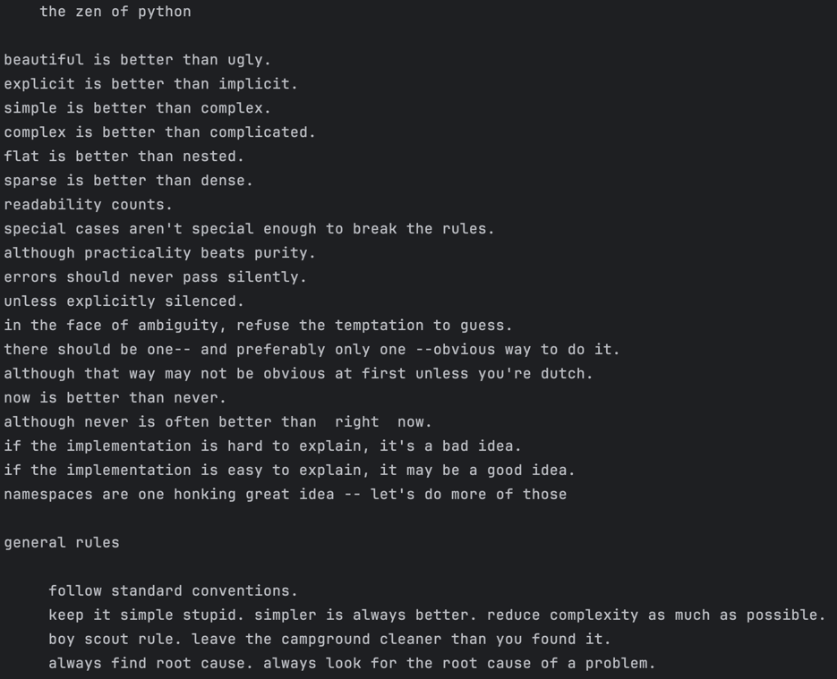
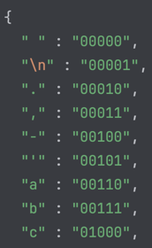

# Task 5. Text compression

# Demonstration

This oneliner prints out the whole Zen of Python and Uncle Bob's Clean Code tips.
The program code length is 986 characters and the text itself is 3k characters. 
It is possible to generate oneliner that outputs any input texts if you have Python installed. 

# How it works

## Alphabet
The solution supports only latin letters and a few
other characters: ` `, `.`, `.`, `-` and `\n`.

Each letter in the supported alphabet is assigned 
a 5-bit integer. Then, all source text is converted to
such representation.

E.g. letter `c` becomes `0b01000` and letter `p` becomes 
`0b10101`. So the word `ccpp` is then converted to 
`01000010001010110101`.

After that, we encode character triplets by one Unicode 
character in UTF-8 encoding which allows us to use
such encoded string in C++ code.

The UTF-8 encoding works as follows. A single character may
be encoded as follows:

`11110xxx 	10xxxxxx 	10xxxxxx 	10xxxxxx`

meaning that we have 2^21 possible combinations per one character.
However, this is greatly reduced by some unsupported Unicode codepoint ranges. 
we are accounting for the offsets for special control symbols,
so that only 20 bits are available for the compression method.

We could potentially cram 4 latin characters out of the specified
alphabet into a single UTF-8 character. Our encoded Unicode codepoint
is then placed bit by bit into `x`'s of the UTF-8 character. So for the
example above, for the word `ccpp` becomes `11110001 	10000010 	10001010 	10110101`
in binary, has Unicode codepoint `U+422b5` and the character is `񂊵`

While it's possible to convert any text manually, it's easier to use
bundled Python script which generates C++ source file.

Unminified source code is in `./src.cpp`

# How to use

## Prerequisites
To compile oneliner: 
- You need CMake installed and a C++ compiler with C++23 standard support.

To generate oneliner for custom text (optional):
- Have CPython 3.10 and higher installed

## Generate one-liner for custom data (optional)
1. Enter any text into `input.txt` 
2. Run `python generator.py`
3. Go to compile and launch section

## Compile and launch
1. `cmake .`
2. `make all && ./robodreams_contest`
